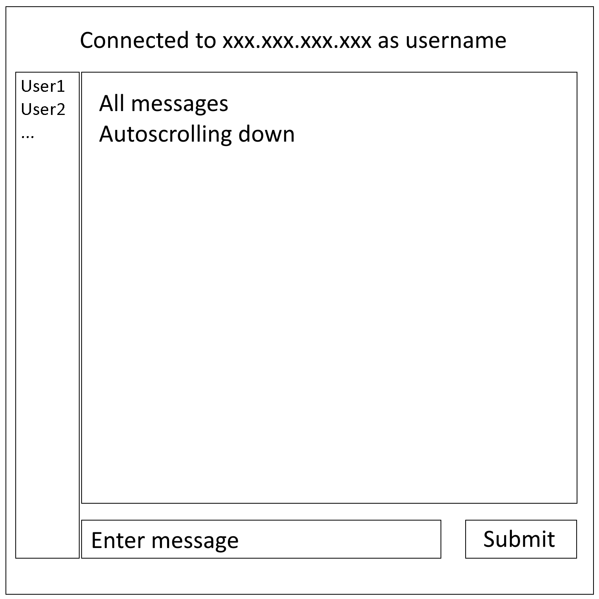

# README
## TLDR
The server relays messages from a user to all users, the client has a GUI and can receive and send messages to the server.

## Introduction
This project will consist of two parts:

- The server which is the central storage for messages, which main function is to relay messages to all connected clients.
- The client which receives messages from the server and sends messages to the server, which then relays the message to all clients connected to the server. The client will also have a wxpython graphical user interface (GUI).

This project will be developed completely using test-driven development (TDD). This is the first time I apply TDD to a project and this project is meant for me to learn TDD.

## Requirements
### Server requirements
The server should be able to have up to *n* clients connected at once. Each client should have two `multiprocessing` processes, one for receiving messages and one for sending messages, in the server application. The server sends messages to clients on port 6969, and receives messages from clients on port 6970. The server contains a message list. Every time a new message is received, it will be appended to the message list and a flag will be set. A separate process on the server side will be checking if the message list has changed every 0.5 seconds. If a change is detected, the process will copy the list to a local copy, pickle it, hash it, and update the hash in the global variable `MOST_RECENT_HASH`. It will also update the global variable `MOST_RECENT_MESSAGES`, containing the pickled message list. Every client sender process function then has a local `latest_hash` variable, which they compare to the global variable every 0.5 seconds. If they differ, they send the new pickled message list and hash to the client, and update their local `latest_hash` variables. This way there will never be concurrency. The clients can then check the hash with the pickled data, and if it matches, unpickle the data and update the message list. The clients can then sort the message list and update the text in the big textfield.

### Client requirements
When the client is started, it should show a prompt asking for the IP-address of the server they want to connect to and the username they want to use. After that it should show a GUI containing a big textfield showing all messages, and a small textfield under that which can be used to send messages. This can be seen in the image below:

## Protocol
A message consists of two parts:

- The header (16 bytes long) consisting of (1) the type of the message (`msg` for normal messages and `cmd` for commands and notifications) followed by (2) a `:` and the length of the message in bytes. The header is padded with spaces until it's 16 bytes long.
- The message data.

The message data consists of a pickled object - in this case the object to be pickled will be the full chat conversation from the server to the client, or a new message from the client to the server - followed by a `chr(31)` and hash of the pickled data. This hash serves as a check if the data is still intact. The final form of the message will be: pickle_data{chr(31)}hash.

The following commands are available (more commands can be added later):

- Server notifications to clients
	- `client_disconnected` for letting all clients know a client has disconnected. It will be followed by a `chr(31)` and the username of the client that disconnected, followed by another `chr(31)` and a timestamp of the server at the time of disconnecting. The character `chr(31)` is chosen here because it is not used in messages. This character can however be typed in by pressing ctrl+shift+-, which requires me to filter ascii character 0-31 and 127 before sending the message to the server.
		- client_disconnected{chr(31)}username{chr(31)}timestamp_server
	- `server_shutdown` for letting all clients know the server will shutdown. It will be followed by a `chr(31)` and the time in seconds until shutdown. A message will be sent at 60, 30, 15, 3, 2, and 1 seconds before shutdown.
		- server_shutdown{chr(31)}timeleft
- Client commands
	- `disconnect` for disconnecting from the server. If this command is not received by the server, it will send a different message to the server, probably something along the lines of `User {username} unexpectedly disconnected` instead of the normal `User {username} disconnected`.
		- disconnect
	- `shutdown` for shutting down the server remotely.
		- shutdown

## Milestones
- [ ] Client front-end and inner workings.
	- [ ] Big textfield for messages.
	- [ ] Small textfield below that for entering messages.
	- [ ] Button next to that for sending the message.
	- [ ] Function to add messages to the textfield.
- [ ] Send-only server
	- [ ] Server can send messages to clients on port 6969, but can't receive any messages. Clients can receive the messages on port 6969 and add them to their message list.
- [ ] Send-receive server
	- [ ] Server can send messages to clients on port 6969, and receive messages from clients on port 6070.
- [ ] Command implementation.
	- [ ] Server can receive commands from clients and execute them.
		- [ ] Command `disconnect` should add a notification to the message list and update all clients, then close the connection and close the process for that client.
		- [ ] Command `shutdown` should add a notification to the message list saying `Server shutting down in 60 seconds...` and update all clients, another message should be sent at 30 seconds, 15 seconds, and at 3, 2 and 1 seconds before shutdown. Subsequently all clients should be disconnected and the server should be shut down.